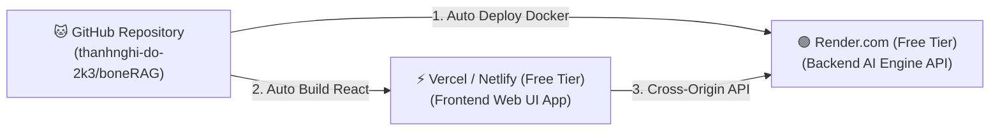

# 🚀 Hướng dẫn Triển khai Tự động CI/CD (Deploy BoneRAG Miễn phí 100%)

Tài liệu này hướng dẫn cách đưa dự án **BoneRAG** lên môi trường Internet công khai hoàn toàn **MIỄN PHÍ 100%** (không cần thẻ tín dụng, không cần Pro subscription).

---

## 🏗️ Kiến trúc Deploy Miễn phí 100%:

---

## 🛠️ Bước 1: Deploy Backend AI Engine trên Render.com (Miễn phí 100%)

1. Truy cập trang web miễn phí **[render.com](https://render.com)** -> Đăng nhập bằng tài khoản **GitHub**.
2. Nhấn **New +** -> Chọn **Web Service**.
3. Chọn repo GitHub **`thanhnghi-do-2k3/boneRAG`**.
4. Render sẽ tự động nhận diện file **`render.yaml` / `Dockerfile`**:
   * **Name:** `bonerag-backend`
   * **Environment:** `Docker`
   * **Instance Type:** `Free ($0/month)`
5. Nhấn **Create Web Service**.

👉 Bạn sẽ nhận được URL Backend API miễn phí công khai 24/7 dạng:
`https://bonerag-backend.onrender.com`

---

## 🌐 Bước 2: Deploy Frontend Web UI trên Vercel (Miễn phí 100%)

1. Truy cập [vercel.com](https://vercel.com) -> Import repo `thanhnghi-do-2k3/boneRAG`.
2. Trong phần **Environment Variables**, thêm biến:
   * **Key:** `VITE_API_BASE_URL`
   * **Value:** `https://bonerag-backend.onrender.com` (Dán URL từ Render ở Bước 1).
3. Nhấn **Deploy**.

---

🎉 **Hoàn tất!** Bạn nhận được đường link web chính thức (dạng `https://bonerag.vercel.app`) chạy trực tiếp 24/7 trên mạng hoàn toàn FREE 100%!
